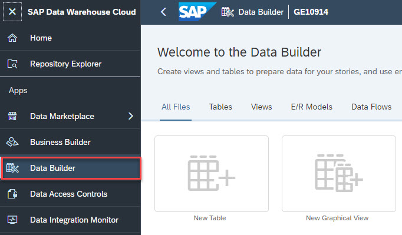
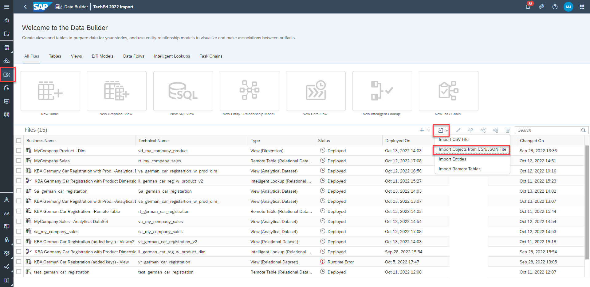
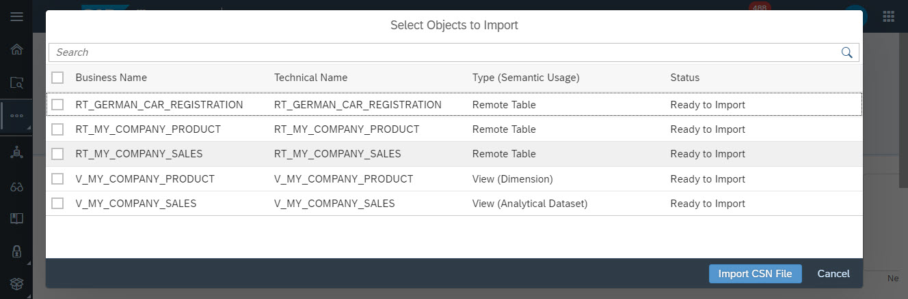
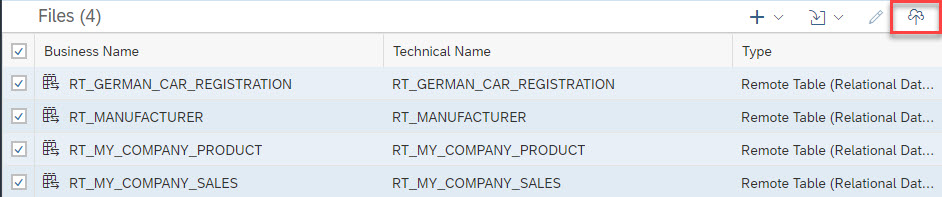
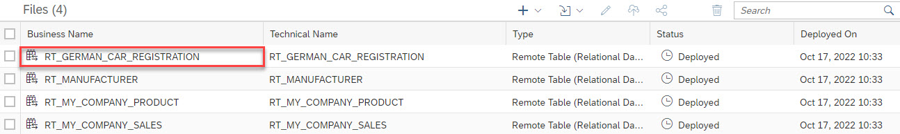
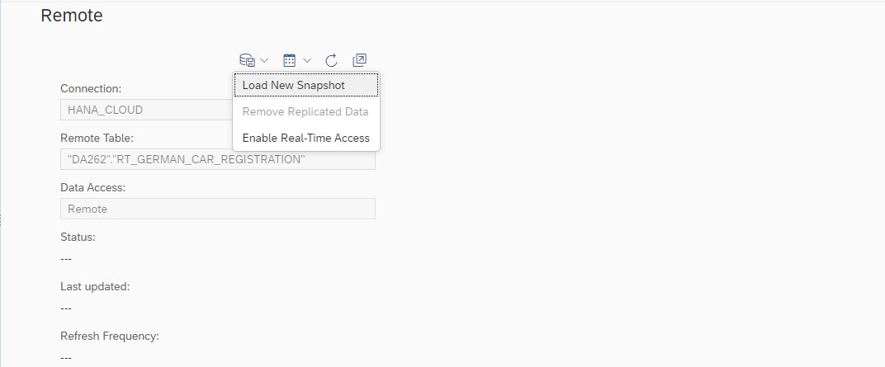
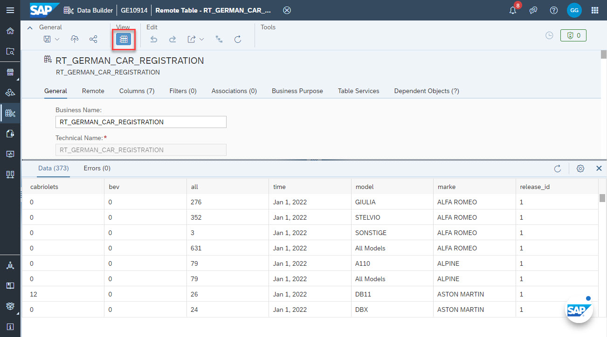

# Exercise 1 - Load data from SAP HANA Cloud

## Introduction
In this exercise get to know and import all necessary data. This consists of: 
- Internal Data 
    - MyCompany Sales - Remote table containing daily sales in units per product of the *MyCompany* business
    The sales data is used in other projects and thus wrapped in a view that can be consumed directly by SAC. 
    - MyCompany Product Master - Product Master of the *MyCompany* business. Other projects are also using it and their requirements have been met by wrapping it also in a view
- External data
    - German Car Registrations - Monthly car registrations in Germany by model & brand 

Normally, your sales data and product masters would be original in your S/4 system and be loaded into SAP Data Warehouse Cloud as part of your normal modelling work. External data is best found and integrated using [SAP Data Marketplace](https://blogs.sap.com/2021/12/13/sap-data-warehouse-cloud-data-marketplace-an-overview/), which itself is an integral part of SAP Data Warehouse Cloud. Once all data has been loaded, the data harmonization, modelling & reporting steps would be performed

In the context of this TechEd workshop, we focus primarily on the harmonization, modelling & reporting steps. We'd love to showcase SAP Data Marketplace as well, but since it is not available in the DWC Guided Experience systems, we can only point you to background information on it. 

The rest of the data integration to SAP Data Warehouse Cloud is amply covered in [TechEd workshop DA160](https://github.com/SAP-samples/teched2022-DA160) and we therefore decided to take a shortcut on the data integration bits. We are planning to provide dedicated own information about how to run the exercise outside of the DWC Guided Experience system (e.g. by using your own SAP Data Warehouse Cloud tenant and uploading CSVs or connecting to Amazon Athena with it). The respective information will be published in this repository as well.  

## Exercise 1.1 - Load JSON

1. Download [this archive](/TechEd_2022_DA262.zip). It contains all metadata that the SAP Data Warehouse Cloud repository needs to identify & connect the HANA cloud tables relevant for this exercise as well as the views for sales & product data. In essence, the objects marked in green on the [overview page](/exercises/overview/README.md) are contained. For your convenience, also a copy of the data is provided as CSV, but what you really need is only file *Connection_HANA.json*
2. Unpack the archive to a local folder. Find file *Connection_HANA.json*
3. Open the Data Builder in the SAP Data Warehouse Cloud.   
If prompted, choose your space (in DWC Guided Experience systems, there's only one space by default, so you should not be prompted).   
3. Click on the *Import* icon in the action bar and choose *Import Objects from CSN/JSON*.   . Navigate to the file *Connection_HANA.json* and choose *Open*
4. In the import dialog, select all four objects and choose Import CSN File.   . 
5. Wait for the import to complete. You'll get a notification about this.
6. In the Data Builder, check check all five objects and choose *Deploy* from the action bar. Wait for a success message of the deployment before you proceed further
  

## Exercise 1.2 - Create Snapshot and inspect data

For optimal performance we are going to replicate the data of the connected tables to SAP Data Warehouse Cloud.

For **each of the four tables**, do the following
1. Click on the table name in the Data Builder   
2. In section *Remote*, find the the save icon and click on "Load new Snapshot".      
3. You should get a "Replication started"-message.    
4. Inspect the table data by choosing the Data Preview icon in the action bar   

# Summary
Now you have laid the foundation for modeling your data. You have loaded the remote tables, that reside in the SAP HANA.

Continue to - [Exercise 2 - Map car registration data to internal brand master](../ex2/README.md)
