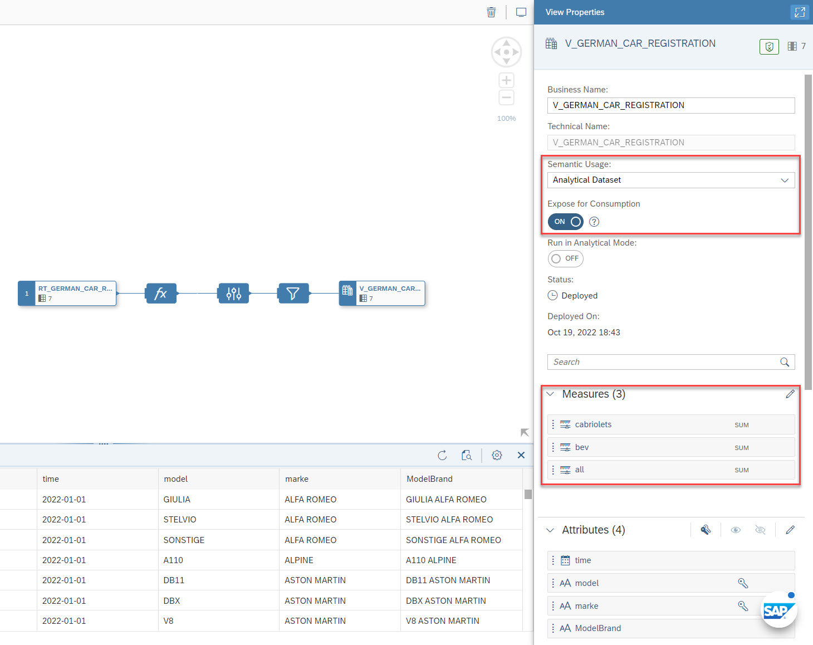
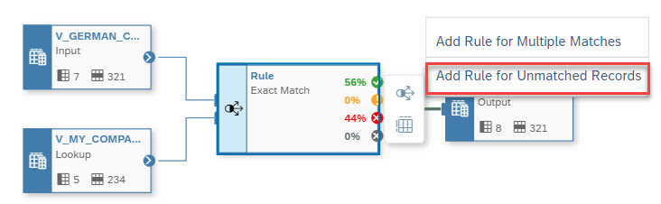
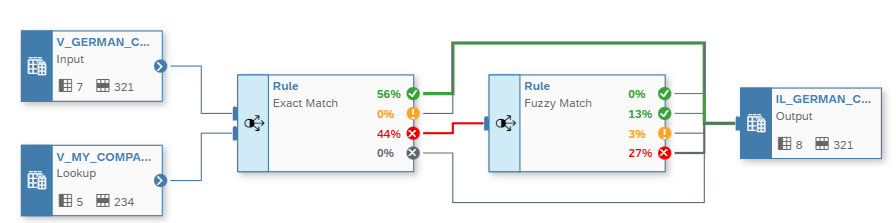
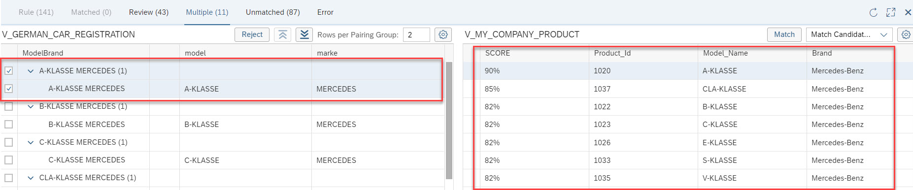
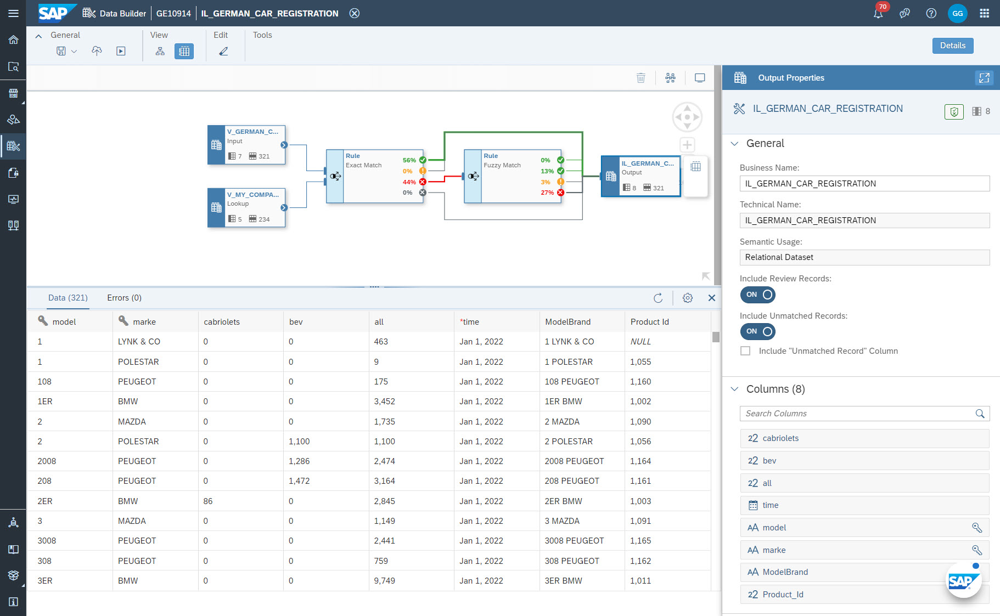

# Exercise 2 - Map external car registration data to internal product master data

One of the challenges when working with external data is that they regularly don't quite fit 100% with your internal data, making joint reporting of external and internal data together quite difficult. 

In the case at hand, the brand names used by the external data set for car registrations do not fit 100% to your brand names used in your product master data RT_MY_COMPANY_PRODUCT. Also some of the model names differ. Examples are: 

Brand name in external data set | Brand name in product master | Issue 
---|---|---
| BMW   | BMW     | none    |
| CITROEN | CITROEN | none | 
| NISSAN | Nissan | upper vs. lower case | 
| TOYOTA | Toyota | upper vs. lower case | 
| Volkswagen VW     | VW       | different brand name      |
| MERCEDES | Mercedes-Benz | different brand name | 

This leads to the situations that simply joining the car registration data for car models with the product master data on these car models will not lead to the desired result. Luckily, SAP Data Warehouse Cloud has an own operator to help in this situation, namely the [Intelligent Lookup](https://blogs.sap.com/2021/12/21/one-stop-shop-to-intelligent-lookup-in-sap-data-warehouse-cloud/) operator. It helps to bring data together that "almost" matches, but not quite - just as in our situation here. It does this by formulating a series of match rules that define when certain entities (in our case brand names) match to each other. In the background, Intelligent Lookup uses the rules to build up a match table of IDs used on either side denominating the same thing (here: brands). By help of this hidden "pairing table" the two "unjoinable" tables now become joinable.  

In order to make use of the Intelligent Lookup, we need to ensure that the participating entities (i.e. in our case car registration table and product master view satisfy certain conditions: remote tables need to be wrapped in views and all entities need to have key definitions. So this is what we are going to do: 

- [Exercise 2.1 - Wrap Remote Table with Car Registration Data and Add Keys](#exercise-21---wrap-remote-table-with-car-registration-data-in-graphical-view-and-add-keys)
- [Exercise 2.2 - Create Intelligent Lookup between Car Registration View and Product View](#exercise-22---create-an-intelligent-lookup-between-car-registration-view-and-product-master)

## Exercise 2.1 - Wrap Remote Table with Car Registration Data in Graphical View and Add Keys
Since Intelligent Lookup requires key columns in the participating entities, let's wrap the car registration table in a view and set its key columns:

1.	Go to the Data Builder. If prompted, choose your space from [exercise 1](../ex1/). 
2.	Click on "New Graphical View".   
3.	From the repository pane on the left, drag & drop your table *RT_GERMAN_CAR_REGISTRATION*.   
4. Choose the table node *RT_GERMAN_CAR_REGISTRATION*. In its context pad, choose the function symbol to create a calculation node.   
5. In the properties panel of the calculation node, create a new calculated column by choosing Plus-sign > Calculated Column. This column will later play a role as ["pairing column"](https://blogs.sap.com/2021/12/21/intelligent-lookup-faq/#WhatIsAPairingColumn) of the Intelligent Lookup. 
  
6. In the empty panel of the new calculated column, fill these fields:
    - Business Name: *ModelBrand*
    - Technical Name: *ModelBrand*
    - Data Type: *String*
    - Length: *5000*
    - Expression (choose *Validate* to confirm correctness): <code>CONCAT(CONCAT(model,' ',),marke)</code>
    

      

8. Choose the calculation node and add a projection node in the context pad. Projection nodes allow exlusion of columns (here: *release_id*) and renaming of columns (here: from *id* to *Product_Id*).   
9. In the details panel of the projection node, choose column "release_id", open the three dots and choose *Exclude column*.   

10. Inspect your data choosing the preview icon in the context pad of the projection node. If you look closely, you see that the car registration data contains a summary number "All models" that simply sums up the individual registration numbers of individual models of a given brand. 
  

11. In order to avoid double counts during reporting, we need to filter these records out.  
We create a new filter node by choosing the filter icon on the context pad of the projection node
  

12. In the properties panel of the filter node, we set the filter expression to <code>model != 'All Models'</code>  
Check the data preview panel that these records are indeed filtered out
  

13. Now let's do final adjustments on the last node. For once, choose the final node and select column *Time*. Select the three dots to open its context menu. Choose the menu entry *Set as key* to make time a key column of the view.   
14. Also turn *model* and *marke* (German for "brand") into key columns.

15. In the properties panel of the final node, change drop-down for Semantic Usage to *Analytical Dataset*. This turns the current view into a multi-dimensional artefact that can be consumed directly by SAP Analytics Cloud. In order to fully configure the artefact, drag & drop columns *all*, *bev* and *cabriolet* to section *Measures*
  
12. Choose *Save* in the action bar.   
13. In the prompt, set technical and business name to *V_GERMAN_CAR_REGISTRATION*.   
14. Deploy the view by choosing *Deploy* in the action bar. 
  

We have now generated all runtime artefacts in the HANA Cloud system underneath SAP Data Warehouse Cloud to report the external data on car registrations also in SAP Analytics Cloud. The only problem is that the models & brands that the data refers to isn't quite aligned with our internal product master. This is what we will be fixing now.  

## Exercise 2.2 - Create an Intelligent Lookup between Car Registration View and Product Master

1.	In Data Builder, click on "New Intelligent Lookup". 
  

2.	From the repository pane on the left, drag view *V_GERMAN_CAR_REGISTRATION* onto the landing zone for *Input*. Define the column *ModelBrand* as a pairing column by dragging it into section *Pairing Column* from the column list in the detail pane. The error notification on the input node will disappear once this configuration is made.  
The configuration of a *pairing column* ensures that the product ID that was identifed for a given model-brand combination is reused for different dates. To take a concrete example, once *PEUGEOT+108* and *Peugeot+108* are identified as meaning the same model-brand combination, then this information is reused across different records of the car registration view, i.e. across the car registration records for January, February etc. [This FAQ entry](https://blogs.sap.com/2021/12/21/intelligent-lookup-faq/#WhatIsAPairingColumn) explains the background for this in more detail.   

 3. From the repository pane on the left, drag view *V_MY_COMPANY_PRODUCT* onto the landing zone for *Lookup*. Define the column *Product_Id* as a return column by      dragging it from the column list onto the section *Return Column*. The error notification on the lookup node will disappear once this configuration is made.   
 A return column is a column that is added to the input view, but its value is "looked up" from the matching entry in the lookup view. 
   

 4.	Define a first rule to create initial mappings.  
 Intelligent Lookup differentiates between exact match rules and fuzzy match rules. Exact match rules work roughly like a join and make exact comparisons of field names. Unlike standard joins, they can be graceful about upper-lower case spellings though (advanced setting).  
 Select the rule node and check its detail panel. Via drag & drop, make a mapping between the model column of the input view (car registrations) and the model column of lookup view (product master). Likewise, make a mapping between the column *marke* (German for *brand*) of input view and the column *brand* of lookup view.  
 In section *Advanced Settings*, uncheck *Case-sensitive*.  
 Through this configuration, you are telling Intelligent Lookup to lookup the respective product master for each record of the car registration by doing a case-insensitive comparision of model and brand fields. In the best of cases, only a single lookup record matches this criterion. Then the match is made, stored & reused for every record in the car registration dataset with the same value of *ModelBrand*. That means also across e.g. car registrations for different points in time, for the same model & brand combination. If more than one lookup record is found, the system will classify this as multiple match. If no lookup record can be found with this rule, the system will classify the record as unmatched. 
   

 5. Let's see what happens on deployment and run. Choose *Deploy* in the action bar to start deployment. 
    

 6. In the prompt, give the operator the name *IL_GERMAN_CAR_REGISTRATION*.
  
7. Once deployment is done (which can take 1-2 minutes), run the operator.
  
8. Once the run is successful (which again can take 30sec to one minute), start inspecting the results. 
The first thing to realize is that out of all 373 records of the car registration view, 48% could be matched successfully with this rule while 52% couldn't.
  
9. To inspect the results in more detail, open the data preview of the rule and inspect the "buckets" for matched & unmatched records of the car registration dataset. Let's first inspect the matched records by opening the preview via the context pad of the rule and choosing the matched tab.   
**Note: at the time of writing of the document, the matched bucket has an irregularly occuring display bug on the matched tab of the data preview. It is expected to be fixed in time for the Teched hands-on session**.
When inspecting the results in detail, you realize that Intelligent Lookup did what your standard join would not be able to do: join over columns in a case-insensitive way. In the marked line, the rule identified POLESTAR/1 as being the same as Polestar/1 and thus "matched" the car registration of that model to the respective product master record (Product Id = 1055).
  
10. Now let's move on to the unmatched records, i.e. those car registration records where the rule couldn't quite figure out which product they belong to in the lookup view. Let's e.g. zoom in on the set of records for *ModelBrand* value A1 S1 AUDI. There is one record for registration date 2022-01-01, but there could be many dates in the same group. Why couldn't the rule find which product the records in the group belong to? When we filter the lookup table on brand = AUDI (just use the column header for this), we immediately see why: the record circuled in red has indeed brand = AUDI, but the model is *A1*. So when our rule says to find a lookup record by doing a case-insensitive comparison of model and brand, then none of the products in our product view does quite pass this test. 
  

11. Intelligent Lookup allows business users now to take a decision here. Mark both entries and click the *Match* button. This will tell the system that the two records are indeed meaning the same model and transfer the record to the *Matched* tab. 
  
12. Since we don't want to take all these manual decisions one by one, we choose to simplify our life and automate the decision making. To that end, our best bet is to be a bit more relaxed about our matching rule logic and do a fuzzy comparison of the model & brand fields. Intelligent Lookup allows to do this by creating a follow-up rule. So let's add such a follow-up rule by clicking the first rule and selecting *Add rule for Unmatched Records* from the context pad.
  
12. This time, we parameterize the rule as fuzzy rule and choose to compare the model & brand names in a fuzzy fashion. To this end, we set the *Match Strategy* drop-down to *Fuzzy Match* and add the match columns *model* and *marke* (German for "brand") of the input view and *Model_Name* and *brand* of the lookup view. You will need to use the three dots in section *Match Columns* to define the participating columns. All other settings keep their default values.  
  
13. Deploy the operator again.
  
14. Once deployed, start a new run.
  
15. Now let's inspect the results. The new rule finds another 12% of records that the rule deems worth reviewing (i.e. the fuzzy match metric came out at >80% and <100%), together with 3% multiple matches and still 37% unmatched records.
  
16. Let's use the data preview again to better understand what's happening here. Let's first turn to what Intelligent Lookup calls "Review" records. These are records where the fuzzy rule could indeed find single matches in the 80% to 100% fuzzy metric bracket, but since they are not 100%, a human user should review their validity.  
If you look closely at the values, the rule could successfuly match MERCEDES/GLS to Mercedes Benz/GLS as well as SKODA/ENYAK to Škoda Auto/ENYAK. This is exactly what we were hoping for and we can thus select those lines and click *Confirm* to push them over to the *Matched* bucket.
  
17. If we continue on to the multiple matches, we find a some interesting artefacts in the data. For example, MERCEDES/GLA fuzzily matches to all three product master records on the right and it's up to the business user to make a call which one it is. This is still manual work, but by triaging the irrelevant product master records from the highly relevant ones, the domain expert receives a huge support boost by the system.
  
18. Finally there are still some unmatched cases in the data, so let's turn to them now. Evidently, none of the lines could be matched through those two rules, but why is this? If we work ourselves through the data a bit we realize different root causes: 
- Brand PORSCHE is not in our product master, because our fleet management service has no use of Porsche cars. As a result, the car registrations on PORSCHE cannot be matched.
- Brand ALFA ROMEO does exist in our product master with model entries for GIULIA and STELVIO, but the car registrations only have a catch-all entry *All models* for them. We need to take a business decision what to match them to. We might e.g. consider adding a catch-all entry for unknown models or unknown makes in our product master and match the car registration to those, filter those registrations out or whatever. Again, this is a business decision on the side of the domain expert.
- Similar reasons apply for the remaining entries: ALPINE again is no known brand, same for LYNK & CO, SUZUKI; for FIAT, HONDA and some of the other brands, they do exist in the product master, but car registration numbers are for *All models* so someone needs to decide how to proceed.  
  
19. Let's finally turn to the output of the Intelligent Lookup, so let's click on the right-most node in the canvas. In the details pane, you can apply some settings like include/exclude of records that are in review or unmatched status. We can set default values, when no *Product Id* could be identified (click the three dots to the right of column *Product Id*) in which case it would make sense to include an *Unmatched Record* column to distinguish default product id values from real ones that might happen to have the same value. 
When we look at the data preview, we find the same 373 car registration records as in the input view *V_GERMAN_CAR_REGISTRATION*, but now we have "looked up" for which Product Id they are and added that as an own column. This additional information will come in handy when we do our analyses for those models  later in the procss.   
Technically, the Intelligent Lookup is just a join of those two tables, but with a hidden helper table in the background to identify which Ids used in the car registration data set match to which ids of the product master. 
  
## Summary

You've now identified for the car registration data which product master record they belong to. This will become important in the next exercise since now both the internal data (*RT_MY_COMPANY_SALES*) and the external data about car registrations now leverage the same product master. In the next exercise, we'll build a multi-fact model that leverages this shared product dimension, thus allowing both data sets to be analyzed along the same dimension for drill-down. 

Continue to - [Exercise 3 - Create a Consumption Model in the Business Layer](../ex3/README.md)
