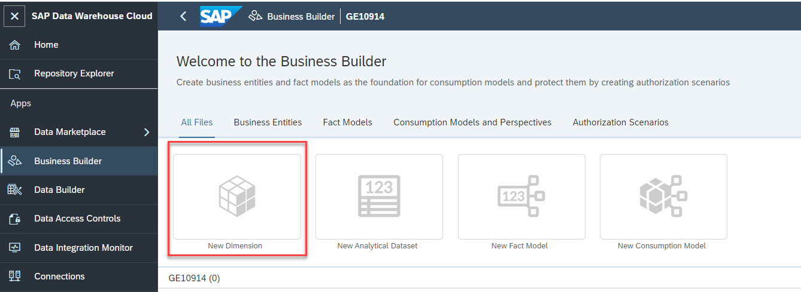
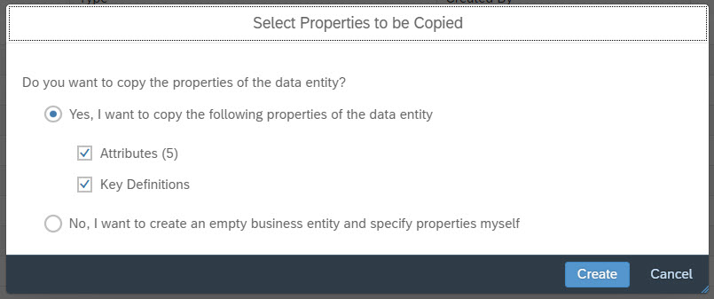
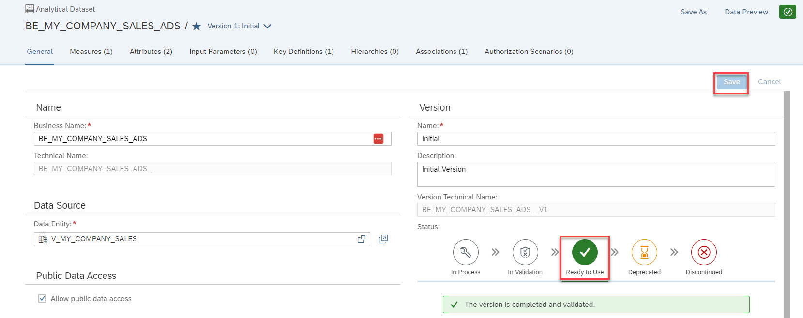

# Exercise 3 - Preparing Analytic Data Consumption via the Business Layer
To create a reusable model for consumption in SAC, you will need to create a reporting model in the [Business Layer](https://help.sap.com/docs/SAP_DATA_WAREHOUSE_CLOUD/c8a54ee704e94e15926551293243fd1d/3829d46c48a44f1e94915054bd76b7b9.html). The Business Builder is the place to define how SAP Analytics Cloud shall see how data shall come together (here: sales data & car registration data), what parts of the data shall be exposed (here: what fields; but we could also e.g. define which hierarchies), which measures are offered and how they are calculated (here: sales figures, car registration figures and the market share as ratio of the two; conceptually also other complex calculations, currency configurations etc. could be configured here). 

In order to thus creat the "analytic view" of our data, we need to create the relevant business entities and subsequently consume them in a *Consumption Model*. The final artefact consumed by SAP Analytics Cloud will be a "Perspective", which is a use case-specific view of the consumption model.  
So let's get started then. These are the steps we are going to run through:  

- Creating Business Entities  
    - [Exercise 3.1 - Create a Dimension for Product](#exercise-31---create-a-dimension-for-product)
    - [Exercise 3.2 - Create Analytical DataSet for Sales Data](#exercise-32---create-analytical-dataset-for-my-company-sales)
    - [Exercise 3.3 - Create Analytical Dataset for Car Registration data](#exercise-33---create-analytical-dataset-for-car-registration-data)
- Create reporting model for SAP Anayltics Cloud
    - [Exercise 3.4 - Create Multifact Consumption Model (Car Registration Data and Sales Data)](#exercise-34---create-multifact-consumption-model-that-brings-together-the-numbers-for-car-registrations-and-internal-sales)
    - [Exercise 3.5 - Create Key Figures](#exercise-35---create-calculated-key-figures)

## Exercise 3.1 - Create a Dimension for Product
Car registration data and sales data both contain facts about the same entity, namely our product master. In DWC Business Layer terms, we talk about a "shared dimension" of the two fact sources and model the product master data as a *Business Layer dimension*. Subsequently, the two fact sources are modelled as *Business Layer Analytical Datasets* that each have an association towards that product dimension. To create the product dimension, please proceed as follows: 
1. Open the Business Builder app via its button on the left
  
2. Click on “New Dimension”. Choose *V_MY_COMPANY_PRODUCT* as data entity and set its business name to *DIM_MY_COMPANY_PRODUCT*. The technical name will be auto-adjusted to *BE_DIM_MY_COMPANY_PRODUCT*. 
  
3. Confirm take over all attributes & key definitions from the underlying view *V_MY_COMPANY_PRODUCT* and choose *Create*. 
  
4. This brings you to the main page of the product dimension dialog. The object is auto-saved, so there's nothing you need to do right now, but it would good if you checked the various tabs and its contents
   
5. Leave the dialog by choosing the cross sign in the header.
  

## Exercise 3.2 - Create Analytical DataSet for My Company Sales
As a preparatory step for the Consumption model of [exercise 3.4](#exercise-34---create-multifact-consumption-model-kba-and-sales), we need to also create "Analytical Datasets". These represent the fact tables of the consumption model that will be the basis for our reporting. Let's start with wrapping view *V_MY_COMPANY_SALES* in an Analytical Dataset of the Business Layer. 

1. Choose to create a new Analytical Dataset
  

2. Select Data Entity *V_MY_COMPANY_SALES* and set the ADS name to *BE_MY_COMPANY_SALES_ADS* for both business name and technical name. Choose *Create*. 
   
3. Confirm to take over all measures, attributes and key definitions.  
 
4. This brings you to the overview page for the Analytical Dataset. Its definition is mostly complete and you may want to look around in the tabs, esp. for Measures, Attributes & Key Defintions
  
5. We are still missing the link to the product dimension, so we need to add an association to it.  
Go to the Associations tab and choose the Plus sign to create a new association
  
6. On the main screen for associations, choose a business entity via the value help
  
7. In the popup, choose the Business Layer product dimension object *BE_MY_COMPANY_PRODUCTS_DIM* that we created in [exercise 3.1](#exercise-31---create-a-dimension-for-product). Confirm the dialog with *Apply*.
  
8. Back on the association screen, you need to define which attribute of the Analytical Dataset is actually linked to the product dimension's key. For us, this field is the *Product Id* attribute. 
  
Note that upon confirmation, an integrity check of the foreign key values is performed (cp. screenshot below)
9. Finally, define a "context" of the association. For our purpose, this can be an arbitrary text (we suggest "context"). This field can be important though in cases where the same target dimension is referenced twice in an ADS, e.g. in cases where an ADS has attributes *SendingCostCenter* and *ReceivingCostCenter* which are both associated to the same cost center dimension. In those cases, it is very important while using the association at reporting time, if we are currently dealing with the sending or the receiving cost center. As said, we can use any arbitrary string here. It nonetheless is a mandatory field and needs to be set. 
Choose *Save* to finalize the creation of the association. 
   
10. As a final step, you can go back to the General tab and set the object's status as *Ready to use*. This status in the version management is optional, but it indicates to users of your object how consumption ready the object is. In a complex organization with many objects that constantly undergo change, such an indication can be very important. If you did indeed set a status, you need to save your work now. 
  

## Exercise 3.3 - Create Analytical Dataset for Car Registration Data

Now we have to create an Analytical Dataset for Car Registration Data.
1. As in the [last exercise](#exercise-32---create-analytical-dataset-for-my-company-sales), start to create a new Analytical Dataset. 
2. Choose the Intelligent Lookup object (i.e. *IL_GERMAN_CAR_REGISTRATION*) that we created in [exercise 2.2](../ex2/README.md#exercise-22---create-an-intelligent-lookup-between-car-registration-view-and-product-master) as your Data Entity. Choose BE_CAR_REGISTRATION_ADS as both business name and technical name. Choose *Create*. 
  
3. The system prompts you to take over the object's properties. Accept the default and confirm with *Create*.   

**Note:** This time, the system only suggests to take over the keys of the data entity; for the sales ADS, measures, attributes and keys were taken over. So what is the reason for this difference? This is because the Intelligent Lookup is classified as "Relational Dataset" while the sales data view was classified as "Analytical Dataset" (to confirm, check the *Semantic Usage* property in the details panel of the objects *IL_GERMAN_CAR_REGISTRATION* and of *V_MY_COMPANY_SALES*). Since relational datasets have no measures and attributes defined, the wizard has no knowledge which fields serve what purpose, so there's nothing to take over. We'll need to add these attributes manually in the next steps.  
  

4. You find yourself on the *General* tab of the Analytical Dataset now. Again, you can browse the tabs to understand its current structure
  

5. Choose the *Measures* tab and add a measure for overall car registrations. Choose the plus sign to start the dialog
  

6. In the resulting dialog, choose the relevant source measure *all* via the value help on field *Source Measure*

7. Overwrite the business name with *Car Registration* and confirm the dialog with *Save*.  
Note that the dialog gives a lot of flexibility in the measure definition. Very much like in SAP Business Warehouse or in SAP Analytics Cloud, various aggregation methods incl. various exception aggregation methods are supported; currency conversion can be activated, calculations can be performed etc. 
  

8. We also need to add attributes to the car registration ADS. The procedure is very much similar as with the measure in the last step.  
Go to tab *Attributes* and choose the plus sign to start attribute creation. 
  

9. In the attribute details page, choose the source attribute to add. We start with the *model* attribute. Open the value help on *Identifier Attribute* and choose the *model* attribute. On close give it a meaningful business name (e.g. Model Name) and close the page by hitting *Save*
  

  

10. Repeat the above 3 steps for these attributes for attribute *marke* also. Set its business name to *Brand name*

11. Add an assocation to the product dimension in the same way as you did for the sales ADS in the [previous exercise](#exercise-32---create-analytical-dataset-for-my-company-sales): 
- Open tab *Associations*
- Create a new assocation via the plus sign
- Open value help on the business entity
- Choose *BE_MY_COMPANY_PRODUCTS_DIM* and confirm with *Apply*
- In section *Target Key Mapping* open the value help for field *Foreign Key* and choose *Product Id* as foreign key  
- Set the assocation context to an arbitrary value (e.g. "product")
- Save your work

**Note:** In this last step, the work done in the Intelligent Lookup finally paid off: our car registration structure now knows about the correct *Product Id* and leverages this for reaching out to the key of the product dimension. Only because of our work on the Intelligent Lookup could this foreign key relationship be drawn. Only with it in place do we have a "shared" product dimension between the two fact sources for sales and car registrations. 

## Exercise 3.4 - Create Multifact Consumption Model that brings together the numbers for car registrations and internal sales
We now have all puzzle pieces in place to put together our consumption model. Once done, it'll look like this and allow reporting of car registration data and sales data along a shared product dimension: 

  

Let's follow these steps to get there: 
1. Create a new Consumption Model.  
 
2. In the wizard, add business name *Fleet Management* and technical name *CM_SALES_REG* and click *Step 2*.
  
3. Choose the first fact source of our Consumption Model. We start with the sales ADS *BE_MY_COMPANY_SALES_ADS*.  
Select it and close the dialog with *Create*  
Note: You can skip *Step 3*. If you clicked *Step 3*, just confirm the defaults. 
   

5. Start adding another fact source by choosing the plus sign on the right of the fact source listing
    
6. In the resulting wizard, choose the car registration dataset and confirm the dialog with *Create*.   
Note: You can skip *Step 2*. If you clicked it, just confirm the defaults. 
   
7. Add the shared product dimension by hitting the plus sign on the right of *Dimension Sources*. 

  

8. In the prompt, choose the product dimension *BE_MY_COMPANY_PRODUCTS* and continue to *Step 2*. 
  

9. Confirm the product dimension alias and move on to *Step 3*. 
  

10. Now the linking between the two Analytical Datasets and the newly added product dimension is performed. Please follow the click sequence as depicted in the animated gif below
  

## Exercise 3.5 - Add key figures

1. Now measures need to be added from the two fact sources to the consumption model *Fleet Management* and going to the *Measures* tab: 
* Add a measure for sales units from the company's internal sales by following these steps: 
    * Choose plus (+) to add a new measure
    * In section *Source*, choose measure *Sales Units* from BE_MY_COMPANY_SALES_ADS. The fields for business name and technical name are filled automatically. 
    * Choose *Save*
* Add another measure for the overall marekt sales
    * Choose plus (+) to add a new measure
    * In section *Source*, choose measure *Car Registration* from BE_CAR_REGISTRATION_ADS. Overwrite the fields for business name *KBA All Vehicle* and technical name *KBA_All_Vehicle*. 
    * Choose *Save*

   

2. Next we add a calculated measure for the market share. The market share is calculated as the ratio of the company's internal sales and the overall market sales. Interestingly, that calculation needs to happen **after aggregation**, i.e. depending on the current drill-down state, first the internal sales and market sales need to be aggregated and only then is the ratio calculated. This calculation after aggregation is one of the reasons why the number can only be calculated in the consumption model (i.e. as part of your *analytical modelling* and not in the relational views underneath (where all calculations are within in single database record row).   

Follow these steps to calculate the market share <u>after aggregation</u> correctly  
* In the *Measures* tab, Choose plus (+) to add a new measure
* In section *Name*, set business name to *Market Share* and the technical name to *Market_Share*
* In section *Source*, choose to create a Measure Type *Calculated Measure* 
    
3. Create the calculation for market share by dividing measure *Sales Units* by measure *Market Sales*. Both can be added manually (just type their name) or by using button *Add measure to formula*
   
4. Divide measure *Sales Unit* by measure *Car Registrations*. And click "Save".  
  
5. Now we have to create the attributes that users can use to drill-down by, namely *Brand*, *Group*, *Model* & *Orign*).  
For each of the four attributes, do the following: 
* Switch to *Attributes* tab 
* Choose plus (+) sign 
* In section *Source*, select attribute type *Dimension Source Attribute*
* Choose respesource attribute (e.g. *brand*, *group*, *model*, *origin*)
* Define business name and technical name
* Save your work  
**Note:** after these steps, you will have created <u>four</u> attributes  
 
  
  
 
 
6. Go to the *General* sheet and check the *Allow public data access* box. This specifies that no dedicated "authorization scenario" is active to restrict data access for individual users or groups to specific parts of the data.  
Then click "Save".   
  
7. Now there should be a green check in the right upper corner. If there is a red cross something went wrong. Please check the failure message.  
  
8. To create a story based on this Consumption Model, you need to create a "Perspective". Perspectives are use case-specific adaptations of the Consumption Model, where you can potentially downsize the consumption model or make its data available to different users with different authorization scenarios. An example here would be that the same sales data for product by region could be made available for regional managers (they see all products, but only for their region) and for product managers (they see only their product, but for all regions). This is why conceptually this additional level in the consumption stack can make sense and allow for clever reuse.  
In our case, we define a very simple perspective by using the *Data Preview* functionality for the Consumption Model.  
So open the *Data Preview* by selecting the respective button on the top right of the screen. 
   

9. Add these columns that you want to expose in SAC via drag-and-drop or by using the three dots (...) and the menu entry "Add to Perspective". by hitting *Save New*  
    * brand
    * model
    * KBA_All_Vehicle
    * Sales Unit
    * Market Share  

Then save your new perspective 
     

10. Leave the Data Preview screeen by toggling the *Data Preview* button. This will bring you back to the Consumption Model screen and all its tabs. 

11. On tab *Perspectives*, find your newly created perspective and click to open it. Hit *Deploy* button to generate the required runtime artefacts in SAP Data Warehouse Cloud. These are what SAP Analytics Cloud will eventually use for querying data.  

## Summary

You've now created a perspective to use in visualization. You can now go into the SAP Analytics Cloud to create a story on top of it.
Continue to - [Exercise 4 - Create SAC Story (Optional)](../ex4/README.md)
