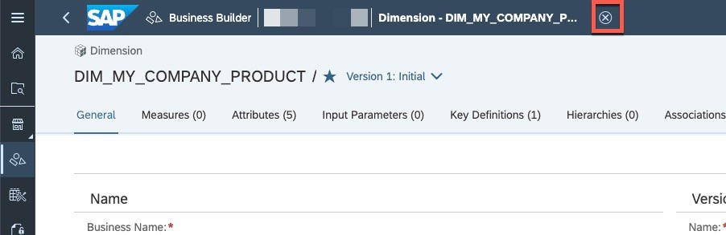

# Exercise 3 - Preparing Analytic Data Consumption via the Business Layer
To create a reusable model for consumption in SAC, you will need to create a reporting model in the Business Layer. To this end, we create the relevant business entities and subsequently consume them in a *Consumption Model*. 

- Creating Business Entities  
    - [Exercise 3.1 - Create a Dimension for Product](#exercise-31---create-a-dimension-for-product)
    - [Exercise 3.2 - Create Analytical Dataset for Car Registration data](#exercise-32---create-analytical-dataset-for-kba)
    - [Exercise 3.3 - Create Analytical DataSet for Sales Data](#exercise-33---create-analytical-dataset-for-my-company-sales-add-association)
- Create reporting model for SAP Anayltics Cloud
    - [Exercise 3.4 - Create Multifact Consumption Model (Car Registration Data and Sales Data)](#exercise-34---create-multifact-consumption-model-kba-and-sales))
    - [Exercise 3.5 - Create Key Figures)](#exercise-35---create-calculated-key-figures)

## Exercise 3.1 - Create a Dimension for Product
Car registration data and sales data both contain facts about the same entity, namely our product master. In DWC Business Layer terms, we talk about a "shared dimension" of the two fact sources and model the product master data as a *Business Layer dimension*. Subsequently, the two fact sources are modelled as *Business Layer Analytical Datasets* that each have an association towards that product dimension. To create the product dimension, please proceed as follows: 
1. Open the Business Builder app via its button on the left
  
2. Click on “New Dimension”. Choose *V_MY_COMPANY_PRODUCT* as data entity and set its business name to *DIM_MY_COMPANY_PRODUCT*. The technical name will be auto-adjusted to *BE_DIM_MY_COMPANY_PRODUCT*. 
  
3. Confirm take over all attributes & key definitions from the underlying view *V_MY_COMPANY_PRODUCT* and choose *Create*. 
  
4. This brings you to the main page of the product dimension dialog. The object is auto-saved, so there's nothing you need to do right now, but it would good if you checked the various tabs and its contents
   

5. Leave the dialog by choosing the cross sign in the header.
  

## Exercise 3.2 - Create Analytical Dataset for Car Registration Data

Now we have to create an Analytical Dataset for KBA.
1. To create an new Analytical Dataset, click "New Analytical Dataset".   
2. Choose the Analytical Dataset you created in the Data Builder as a Data entity. Choose your Business Name and Technical Name. Click “Create”.   
3. In the next dialog choose “yes” and copy the properties. Click ”Create”.
4. Choose the "Key definitions" sheet and add a new definition.  

5. Add a Business and a Technical Name.   
6. Select a "KBA Brand" as a Key.   
7. Click on the "+"-Button and repeat these for "KBA Model" and "time".   
8. Verify your keys and save the definition.     

9. Add an association to the product dimension by opening the association tab and clicking "+".  

To give a common denominator between two fact sources you need to choose a dimension they both have in common. As described above, this "shared" dimension will be the product dimension created in [exericse 3.1](#exercise-31---create-a-dimension-for-product).

10. Select the "MyCompany Products"-Dimension you just created as the Business Entity.   
11. Select the id you want to associate to your product dimension.  
   Choose the "Product ID". This ID will be connected to the Products' Id. This gives you the possibility to filter both models for the same products.  
 
12. Give a context name and "Save". 
 
13. Choose the "General" sheet and switch the status to "Ready to Use".
14. Click "Save".

## Exercise 3.3 - Create Analytical DataSet for My Company Sales

Repeat the above procedures for "My Company Sales".
1. Add a new Analytical Dataset.  
 
2. Choose a name.  
 
3. Choose your measure (Sales Unit).  
 
 
4. Create Attributes for product and date.  
 
 
5. Create key definitions for date and product.
Why? xxx  
  
Don't forget to verify your keys. 
 
 
6. Set your status to "Ready to use". 
 

## Exercise 3.4 - Create Multifact Consumption Model (KBA and Sales)

1. Create a new Consumption Model.  
 
2. Add a name and click "Step 2". 
 
3. Choose your Sales Model to start creating the Consumption Model. Click on the "MyCompany Sales" Model and click on "Step 3". 
 
4. Choose an alias and click on "Create". 
 
5. Add a new Fact Source.  
  
6. Add the KBA Dataset and click on "Step 2".  
  
7. Give your data source an alias click on "Step 3". Then click on create.   
  
8. Add a new Dimension Source, choose "MyCompany Products" and click on "Step 2".   
  
9. Add an Alias and click on "Step 3".  
  
Now you connect the Fact Sources to the Product Dimension.   
  
10. Click on the Fact Source and click on the "Expand"-Icon.   
  
11. Click on the Products and click the "Link"-Icon.   
  
12. Now you have to do the same thing for the other Fact Model.  
Click on the Sales Model and click on the "Expand"-Button.  
  
  
13. Click on the newly expanded Product Dimension and click on the "Link"-Icon.  
  
  
14. Click on "Create".  
  

## Exercise 3.5 - Create (Calculated) Key Figures

1. Now add the Measures (BEV, Cabriolets, Sales Unit, All).   
  
2. Next we add a calculated measure. Add a measure and choose "Calculated Measure".   
  
3. Create the calculation for market share.  
  
Divide "Sales Unit" by "All Vehicles". And click "Save".  
  
4. Now we have to create the attributes, the model will be filtered by (Brand, Group, Model, Orign).   
  
  
  
5. Go to the "General" sheet and check the "Allow public data access" box. Then click "Save".   
  
Now there should be a green check in the right upper corner. If there is a red cross something went wrong. Please check the failure message.  
  
6. To create a story based on this Fact Model, you need to create a perspective. You can either do this by clicking the "+"-Button or by clicking on the "Data Preview". Click on the "Data Preview".  
  
7. Create a table to base your perspective on by drag-and-drop.   
   
8. Click "Save New" and enter a name.  
  

9. Lastly we need to deploy the view. Click to open the perspective you just created.

10. Click on deploy.

## Summary

You've now created a consumption model to use in visualization.
If you want to, you can now go into the SAP SAC to create a story from the SAP DWC dataset. Just choose the DWC as a data source and create your visualization.
Continue to - [Exercise 4 - Create SAC Story (Optional)](../ex4/README.md)
