# Exercise 4 - Create SAC Story (Optional)
After consolidating the data from your company with public data, we want to visulaize the data. This means we will start the SAC and choose the dataset we just created.
Next we will create a small visualization.

## Excercise 4.1 - Show Sales Data in SAC

1. Open the SAC. By clicking the menu in the left upper corner and choosing the SAP Analytics Cloud.

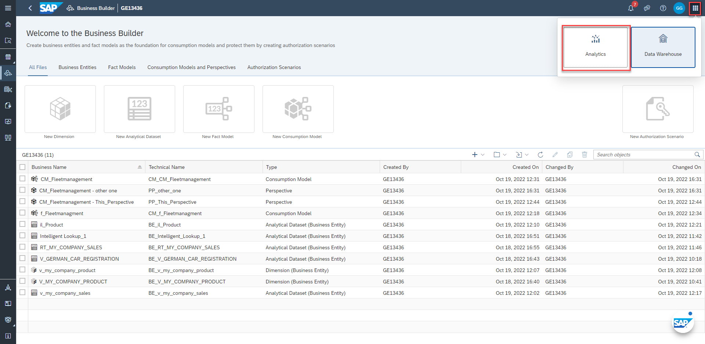

2. Open the "Story App" clicking on the "Story"-symbol.

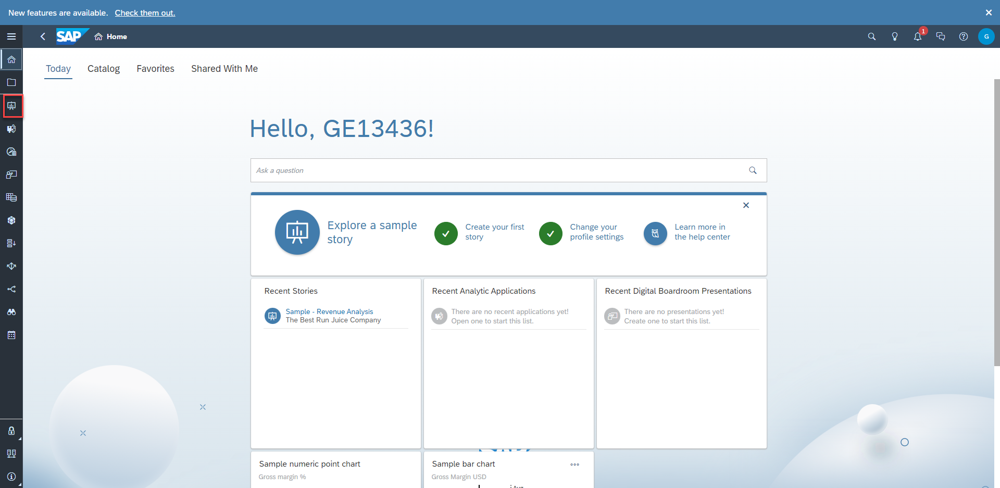

3.Create a new story by clicking on the icon. Choose a "Classic Design Experience". Right now this gives you the most features.

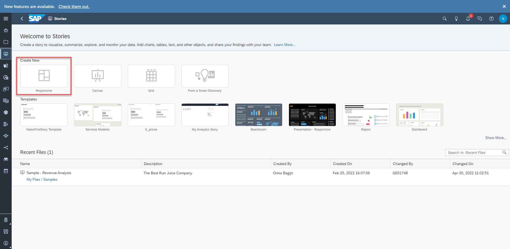

4. To start creating your first visualization, lets have a look at the data. We do this by clicking on the "table"-icon.

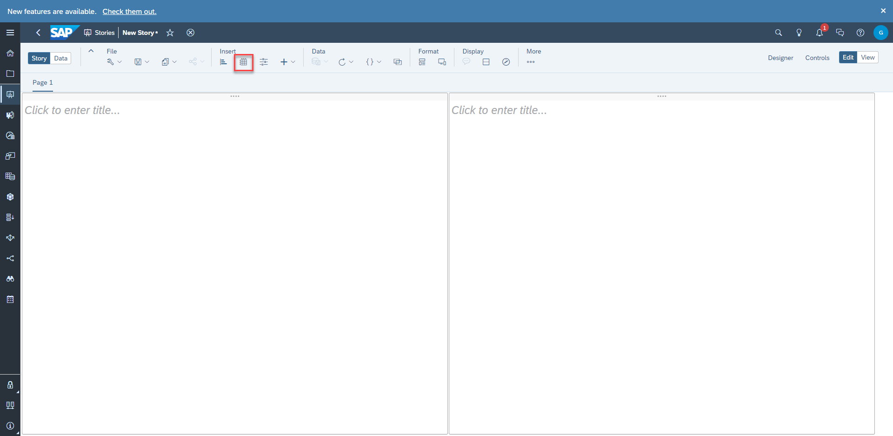

5. To use a dataset for the first time we have to load the model from the DWC once. If we want use it in the Story later we do not need to do that step again.
Use "SAPDWC" as the connection. Choose your "GXXXXX" named Space and choose your "v_my_company_sales" analytical view.

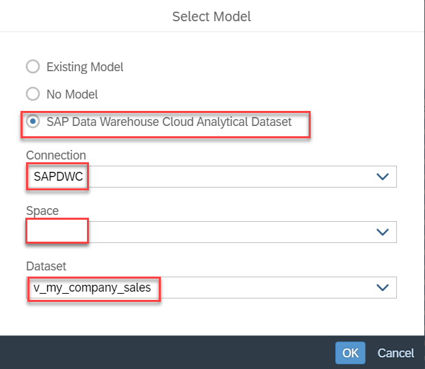

6. In our case we have to choose the "SAP Data Warehouse Cloud Analytical Dataset". And click on the "SAPDWC" connection. Now choose your space (G<number>). And choose the v_company_sales.
  
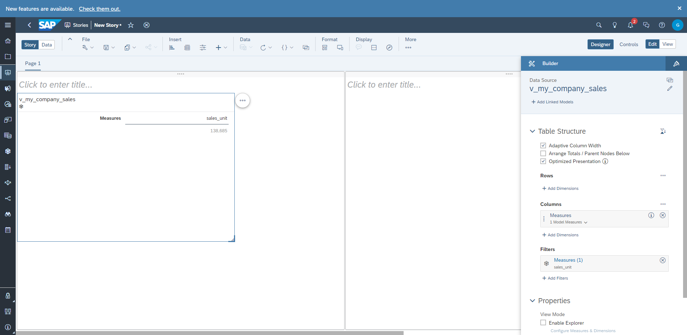

7. Add the "product" Dimension to have a look at the data.

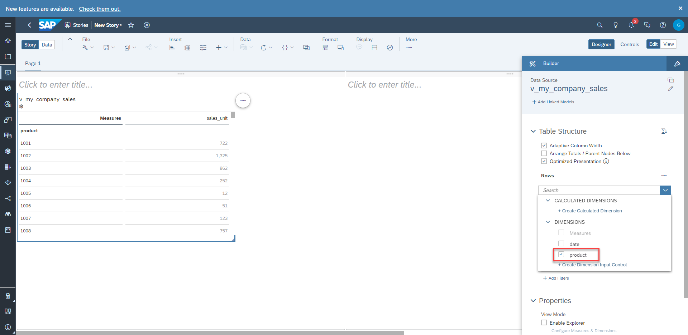

## Excercise 4.2 - Show Marketshare in SAC

Now instead of the Sales Data lets import the Perspective we created. 
1. Create a new table by clicking the table-icon. change the data source by clicking the pen-icon. Click ok, on the warning message (as we want to change the data source).

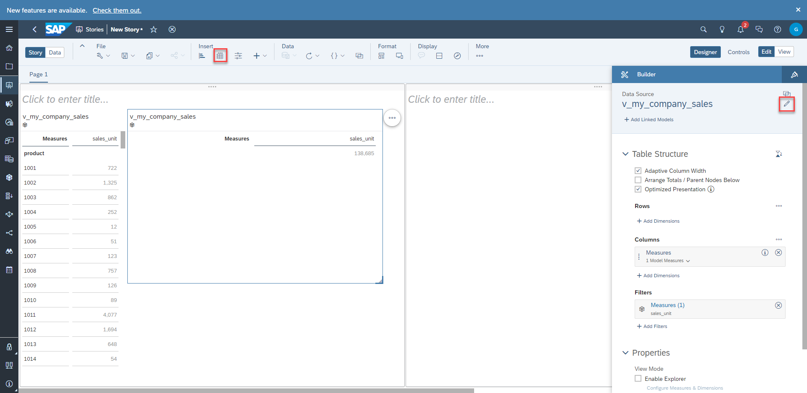

2. Choose your perspective.
  
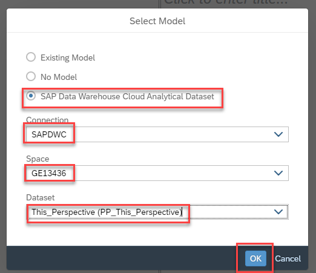

3. Now click on the save-button and save your story.
4. Click the x-Button on the Filter to show all your story.
 
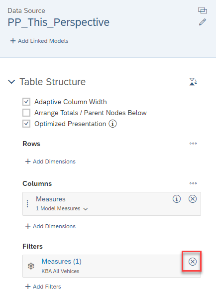
  
5. Lets choose the "brand" as a "Row".

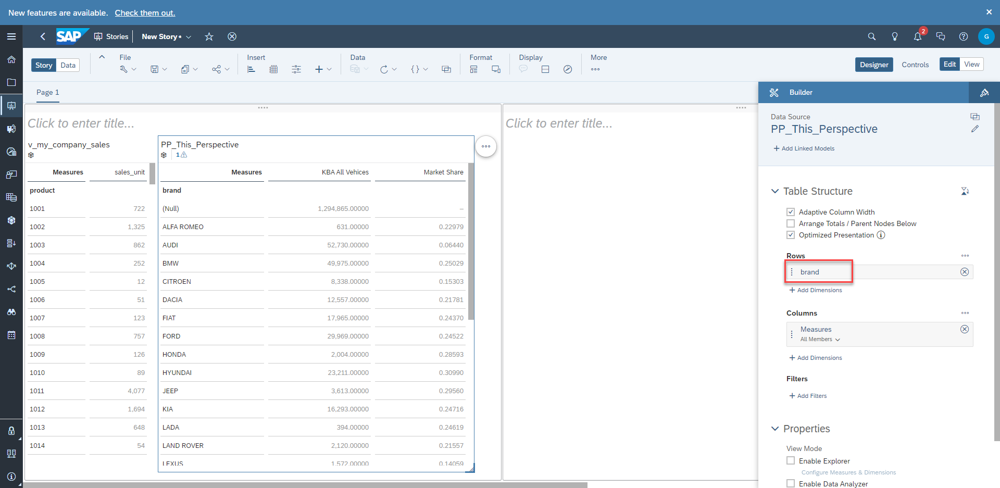
  
6. Now lets create a sample visualization. Click on the chart-icon.

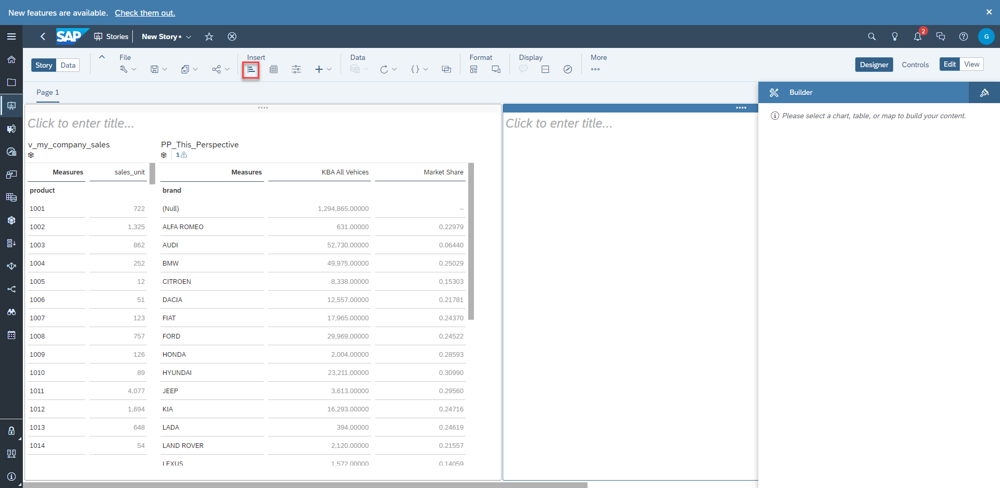

7. Choose "Marketshare" as a measure. Choose "brand" as a Row (expand "V_MY_COMPANY_PRODUCT" to see all possibilities).

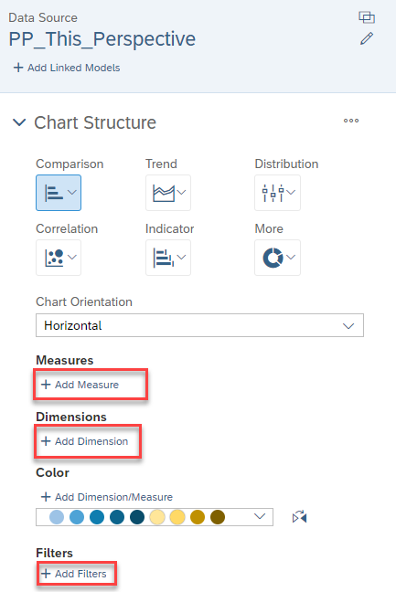
  
8. Next click on "Filter" and exclude "Null".
  
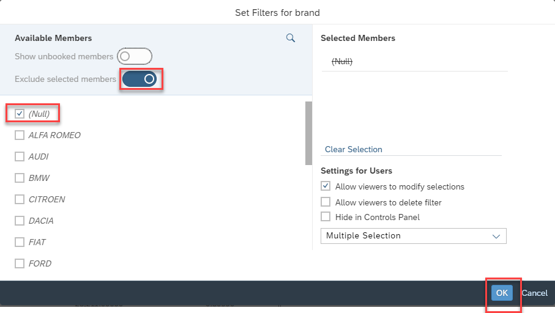
  
9. Add a reference line to see how close your company is to its goal.
  
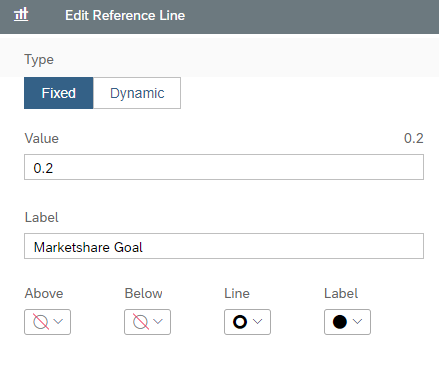

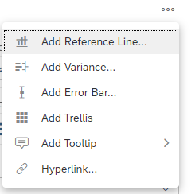

## Summary
Now you have created a visualization for your company. This is how it looks:

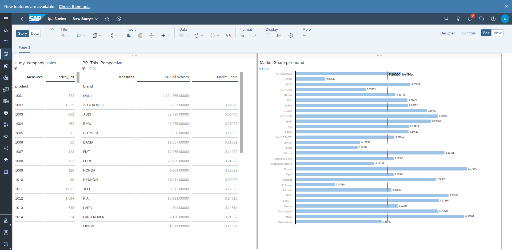
