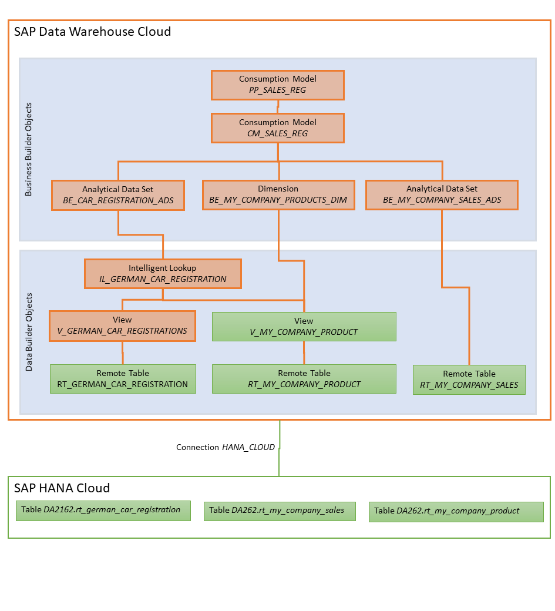

# Overview on exercises and Object Model

The exercises start from an empty DWC Guided Experience system and guide you to build the complete end-to-end scenario from the bottom up. The graphic below gives the complete overview on the object model.

## High-level Overview on the exercises

* In [Exercise 0](../ex0), users lay hands on an empty DWC Guided Experience system. This means that they apply for their own space in a centrally-provided SAP Data Warehouse Cloud tenant. Users receive access to a single space that is initially empty. Connections to backend systems of type HANA Cloud, S/4 HANA Cloud and Google Cloud Platform are provided, but only the HANA Cloud system is relevant in the context of the exercise. In the HANA Cloud system, a schema *DA262* is prepared in which the three tables relevant to this exercise are provided, namely the tables *rt_german_car_registration*, *rt_my_company_sales* and *rt_my_company_product*. 
* In [Exercise 1](../ex1), users import these HANA Cloud tables as "remote tables" by [uploading the respective DWC metadata](https://help.sap.com/docs/SAP_DATA_WAREHOUSE_CLOUD/c8a54ee704e94e15926551293243fd1d/23599e6347fb4c9e9a71c82f62449875.html) for them. Also views building on the sales & product tables are provided. Import happens by virtue of a dedicated CSN file (aka: DWC repository metadata file) that contains the relevant metadata for all objects in green in the graphic above. The tables and their data are residing in SAP HANA Cloud and can be acccessed in a federated manner, but we are taking a data snapshot of them in order to showcase this part of the DWC feature set also. 
* In [Exercise 2](../ex2/), users combine the external dataset for car registrations with the internal master data on manufacturers. Since the car model & car brand names used externally (like e.g. *Volkswagen VW*) and internally (*Volkswagen*) are different, we cannot report the car registration data along our existing product master dimension. In order to heal this fact, we are using a dedicated DWC operator, the [Intelligent Lookup](https://help.sap.com/docs/SAP_DATA_WAREHOUSE_CLOUD/c8a54ee704e94e15926551293243fd1d/8f29f801faea4d48816d0339777f9d16.html) (cp. e.g. also [this blog](https://blogs.sap.com/2021/12/02/proudly-launched-intelligent-lookup-for-sap-data-warehouse-cloud/)) that bridges this problem by cleverly building up a match table that defines which products used in the car registration data set match to which product in the product master data set. Some preparatory work need to happen upfront in a view to make this work.  
* In [Exercise 3](../ex3/), the Data Builder entities created in [Exercise 2](../ex2/) are brought together in an analytical model that SAC uses for reporting. To this end, the participating objects need to be wrapped into [entities of the Business Layer](https://help.sap.com/docs/SAP_DATA_WAREHOUSE_CLOUD/c8a54ee704e94e15926551293243fd1d/c912cdc1537d4efbb24b08327ea68918.html). The fact sources for car registrations and internal sales are wrapped in so-called *Business Layer Analytical Datasets*. The internal product master data is wrapped in a Bare wrapped in a *Business Layer Dimension*. Additionally, an association between the fact sources and the product dimension is created. This will later be leveraged as a "shared dimension" between the car registration numbers and the sales numbers in a "multi-fact model".  
Once these Business Layer entities are defined, users can continue and create a Consumption Model ([SAP Help](https://help.sap.com/docs/SAP_DATA_WAREHOUSE_CLOUD/c8a54ee704e94e15926551293243fd1d/337fa99de4a44700ba49e2214a1f3349.html)).  
Finally, we model the key figures for internal sales, overall car registration and thus market share (as internal sales divided by overall registrations). To finally expose our developments to SAC, we require a perspective - we simply generate one while previewing the data in our model. 
* Finally in [Exercise 4](../ex4/), we leverage the just-created perspective in an SAP Anayltics Cloud story. We simply create a new story, connect it to the DWC data model (i.e. the perspective) and then create the required charts & tables.

Note: Please note that for simplicity sake and considering the small object model, we deviate from the naming conventions proposed in the [Development Guidelines Guide for Data Warehouse Cloud](https://www.sap.com/documents/2021/09/8a0fc7ca-f67d-0010-bca6-c68f7e60039b.html). For your own projects, we suggest your familiarize yourself with the guidelines proposed there. 

## Summary
Now you have understood the overall structure of the exercises and the objects involved. 

If you have no access to a DWC Guided Experience system, get one by following the steps of [exercise 0](/exercises/ex0/). Otherwise, you can directly start with [exercise 1](/exercises/ex1/). 